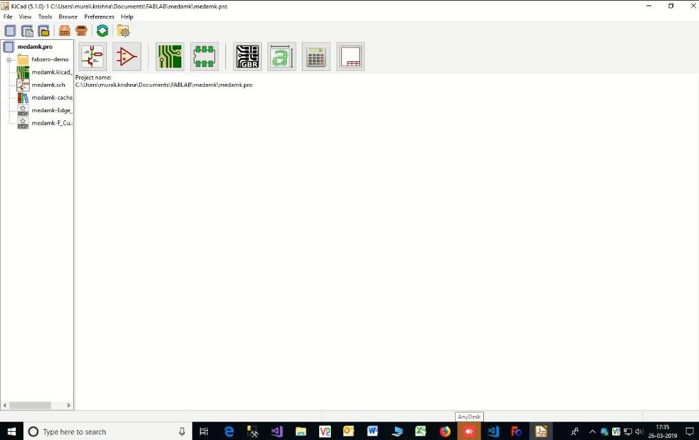
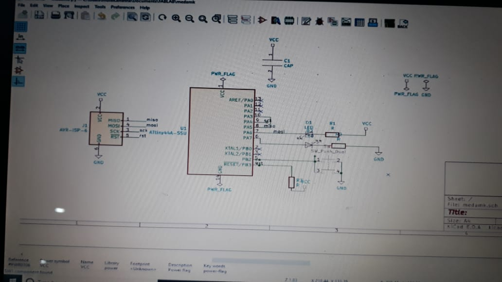
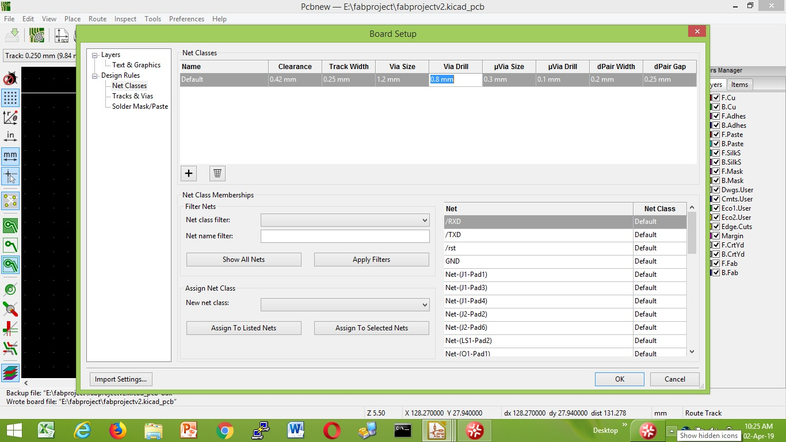
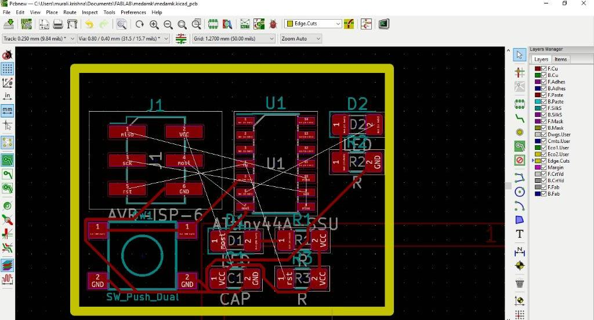
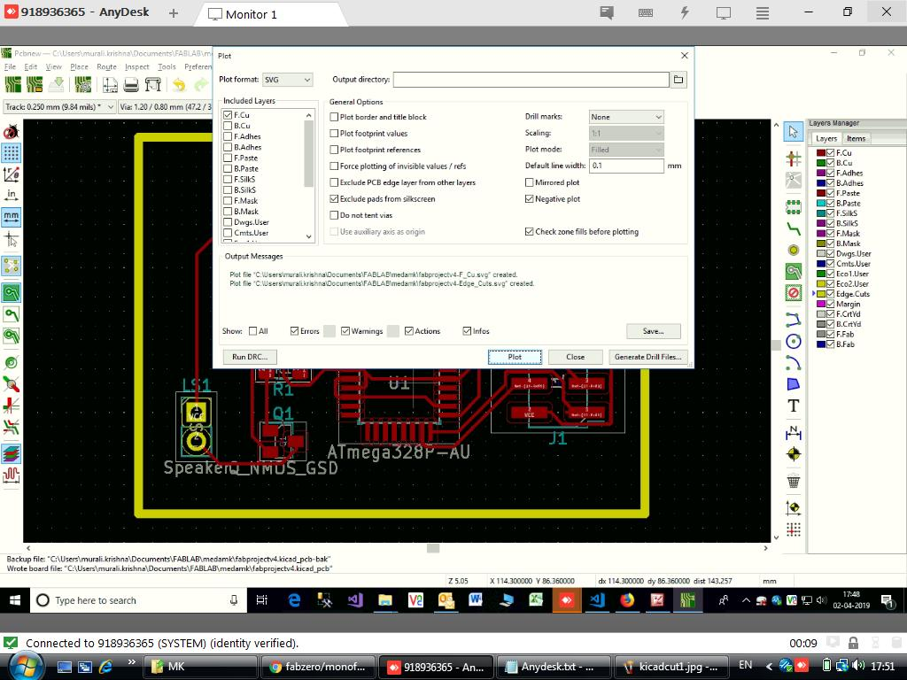
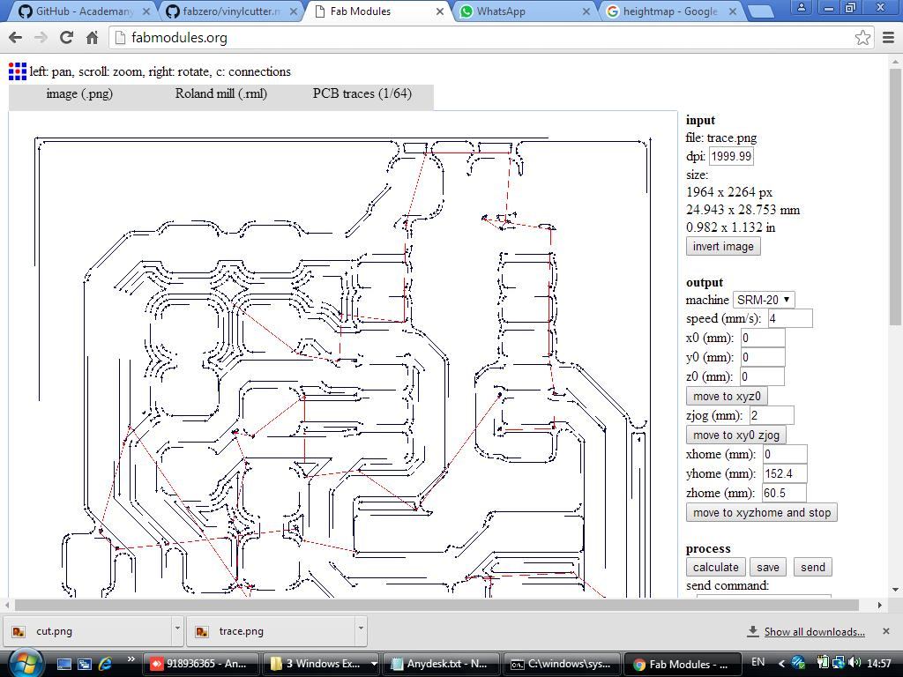
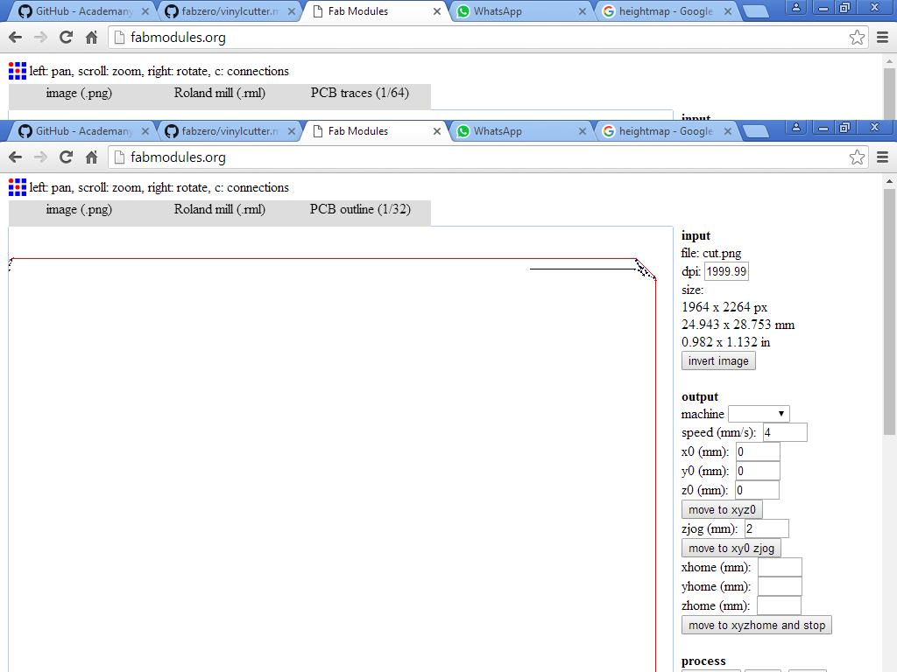
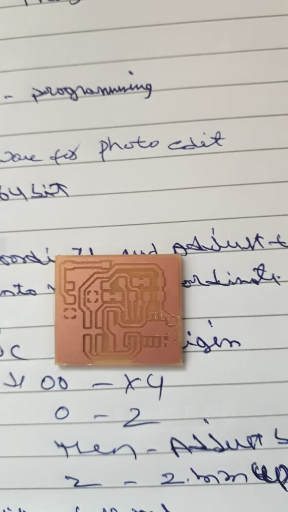

# Roland monoFab SRM-20 Desktop Milling Machine

## Overview
he SRM-20 Desktop Milling Machine is the latest generation desktop milling machine for the office, studio and educational environment. The SRM-20 incorporates innovative features, including a new spindle, collet, circuit boards and control software. The result is a leap forward in milling precision, speed and ease of use. The SRM-20 can mill a variety of non-proprietary materials typically used for prototyping, including chemical wood, acrylic and modeling wax. Optional collets are also available to extend the mill’s capability with a wide range of end mill shapes and sizes, ideal for creating beautiful finishes and intricate details.

## Links

Video Demo: [Youtube Video](https://www.youtube.com/watch?v=3UF_cDjEkYk)

[Milling](https://wiki.oulu.fi/display/FLOWS/Milling)

[PCBs with SRM-20](http://archive.fabacademy.org/archives/2017/doc/srm20.html)

[Download Software and Manuals](https://www.rolanddga.com/products/3d/srm-20-small-milling-machine)

## Workshop
 Installed KICAD 5 Application for PCB Making.  

 - open the KICAD application  
 - 
 - File --> NEW
 - Click on Schematic Layout Editor
 - New Eeschema will open. then Select the components and Voltages with Proper 
 connections. 

 - Perform Electronic Rules Check. If there is No Errors
 - Then click on assign PCB footprints
 - Assign the Components from footprint libraries  

 - generate Netlist and Press F8
 - Click on Board Setup and update New Classes as below
 

 - Give the all connections and  border
 
 - Click on Plot. Select F.cu and Edge.cuts only
 - Select negative plot and mirrored plot. Then Click on Plot.
 

- then two files will be saved in.svg files.
- open each .svg file in inkscape application. Then Export in .PNG file.
- open the website http://fabmodules.org/ to convert into .rml file  
- input the .png file. Select the Roland mill and PCB Trace(1/64). then save the file

- input the .png file. Select the Roland mill and PCB outline(1/32). then save the file

- Install [VPanel for SRM-20](https://startup.rolanddg.com/monoFab/SRM-20/SRM-20_EN/On/sp-srm_about-apps_on_en.html) Application

- Put the (1/64) bit into the machine.
- Put the User Coordinate and adjust the coordinate.
- then put into machine coordinates and record for the save purpose.
- Then Put the User Coordinate and set origin.
- X/Y set 0 and Z set to 0
- Then the adjust the bit to touch the board.
- put Z to 2mm Up
- then press trace. delete all files and choose the trace.rml file
- then press output
- after trace remove the bit and replace (/1/32) bit.
- to origin click xy. Then Z set 0
- Then the adjust the bit to touch the board.
- put Z to 2mm Up
- then press Cut. delete all files and choose the cut.rml file
- then press output.
- output is milled as below

