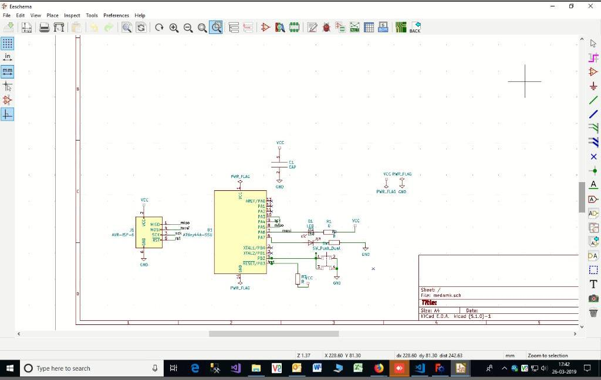

# Roland monoFab SRM-20 Desktop Milling Machine

## Overview
The Roland GX-24 CAMM-1 is a drag knife cutter. You can feed the machine vinyl sticker material for creating custom sized stickers. You can also feed it copper sticker material, useful for flexible circuits or antenna design. The machine can take a material on roll or a piece with the maximum width of 58 centimeters. You will need to prepare a vector graphics file in the shape you want to cut. 

## Links

Video Demo: [Youtube Video](https://www.youtube.com/watch?v=3UF_cDjEkYk)

[Milling](https://wiki.oulu.fi/display/FLOWS/Milling)

[PCBs with SRM-20](http://archive.fabacademy.org/archives/2017/doc/srm20.html)

[Download Software and Manuals](https://www.rolanddga.com/products/3d/srm-20-small-milling-machine)

## Workshop
 Installed KICAD 5 Application for PCB Making.  

 - open the KICAD application  
 - File --> NEW
 - Click on Schematic Layout Editor
 - New Eeschema will open. then Select the components and Voltages with Proper 
 connections. 

 - Perform Electronic Rules Check. If there is No Errors
 - Then click on assign PCB footprints
 - Assign the Components from footprint libraries  

 - Save and Press F8
 - Give the all connections and  border
 
 - Click on Plot. Select F.cu and Edge.cuts only
 - Select negative plot and mirrored plot. Then Click on Plot.
 

- then two files will be saved in.svg files.
- open each .svg file in inkscape application. Then Export in .PNG file.
- open the website http://fabmodules.org/ to convert into .rml file  
- input the .png file. Select the Roland mill and PCB Trace(1/64). then save the file

- input the .png file. Select the Roland mill and PCB outline(1/32). then save the file
