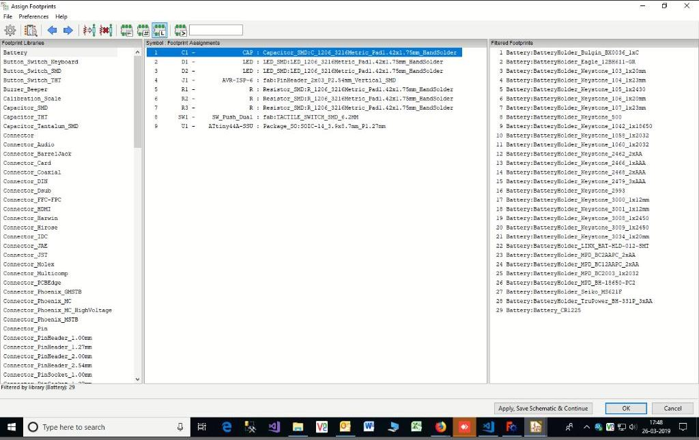

 Installed KICAD 5 Application for PCB Making.  

 - open the KICAD application  
 - File --> NEW
 - Click on Schematic Layout Editor
 - New Eeschema will open. then Select the components and Voltages with Proper 
 connections. 

 - Perform Electronic Rules Check. If there is No Errors
 - Then click on assign PCB footprints
 - Assign the Components from footprint libraries  

 - Save and Press F8
 - Give the all connections and  border
 
 - Click on Plot. Select F.cu and Edge.cuts only
 - Select negative plot and mirrored plot. Then Click on Plot.
 

- then two files will be saved in.svg files.
- open each .svg file in inkscape application. Then Export in .PNG file.
- open the website http://fabmodules.org/ to convert into .camm file  
- input the .png file. Select the Roland mill and PCB Trace(1/64). then save the file

- input the .png file. Select the Roland mill and PCB outline(1/32). then save the file
