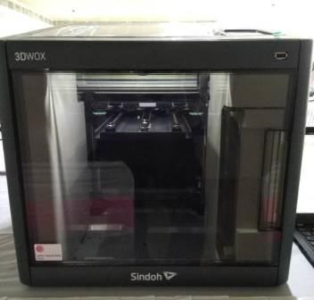

## ABOUT ME

This is Meda Muralikrishna. I am from STPI-Hyderabad. Working as Technical Officer. 
I have complited my special diploma in Electronics and communication s from GIOE, Secunderabad. Then completed my B.tech in Electronics and Communication Engineering from JNTU-Hyderabad.

I have joined in STPI on 16th Feb 2001. 

## ABOUT FAB LAB Pre-Academy Programme

I got opertinuty getting training on FAB LAB Pre-Academy Programme at STPI-Bhubaneswar from 18th March to 05th April 2019.

On 18th March 2019 at 11:00 AM This Pre-Academy training program has ben launched by Shri.Omkar Rai, DG, STPI. through VC from STPI-HQ 


I met all other colleagues attending for the training programme from PAN India.
My trainers are Mr.Franchies and Mr.Sibu. Both are explaining well.

In the afternoon along wit Mr.Franchi and Mr.Sibu we have visited FAB LAB two rooms.
Mr.Franchie has briefed about the equipments.

- Roland Cutting Plotter  


- 3D Printer(FDM)  



Roland, EPILOG LASER, PUREX, 3D WOX Printer, Weller heat gun and soldering rod.


FORMLABS 3D printing device.

Shopboat wood cutter which runs at 14,000 rpm

WEN and DeWALT equipment.<br>

Insatllations:  

- Installed visual Studio Code
- Installed Code Spell Checker in visual Studio Code
- installed Inkscape.
- installed Ultimate Cura.
- installed Windows GIT
- Linkage Windows GIT to visual Studio Code:

1. open New Window in visual Studio Code

2. Copy the clone Address from github 

3. Control + Shift + P  

4. New address will open then type Git: Clone pate the clone address  

5. install Windows GIT. then automatically GIT Bash also will be installed and open GIT Bash

```javascript
admin@STPH13LP01 MINGW64 ~
$ git config --global user.name medamk

admin@STPH13LP01 MINGW64 ~
$ git config --global user.email 

admin@STPH13LP01 MINGW64 ~
$ git config --global user.email 
```

## Demo Session

 - [Roland CAMM1 GS-24 desktop cutter](vinylcutter.md)
 
 - [Sindoh 3DWOX DP200 3D Printer](sindohedwox.md)
 
 - [Roland DGA MonoFAB SRM-20 Desktop Milling Machine](monofabsrm20.md)

 - [Sense 3D scanner](sense3dscan.md)

 - Supply Vs Demand Time
 - FREE CAD 3D
 - KICAD --> PNG
 - Documentation
 - Programing
 - 3D Scanning
 - Molding & Cast
