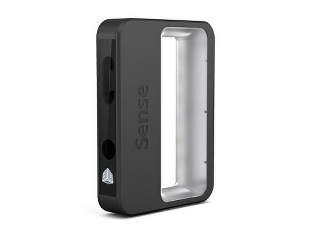

# Sense 3D Scanner

## Overview
The Sense 3D scanner delivers best-in-class accuracy of close to 1 mm with resolution at 1 mm.
Life goes on
Sense has an unprecedented color resolution of 1920 x 1080 pixels for perfect color texture mapping.
Zero in
Sense has a generous scan range of between 7 and 72 inches to allow for rapid 3D scanning of a wide range of objects.
Capture
The Sense 3D scanner includes software to rapidly edit your 3D scan data and solidify for immediate 3D printing.
Life is Better
Save data out to four industry standard formats: OBJ, WRL, STL, and PLY, for downstream uses. 

## Links

Video Demo: [Youtube Video](https://www.youtube.com/watch?v=YmTvGLliGmw)

[Download Software and Manuals](https://www.3dsystems.com/shop/sense/downloads)

## Workshop
Scanned withe Sense 3D Scanner. Printed with Sindoh 3DWOX DP200 3D Printer

