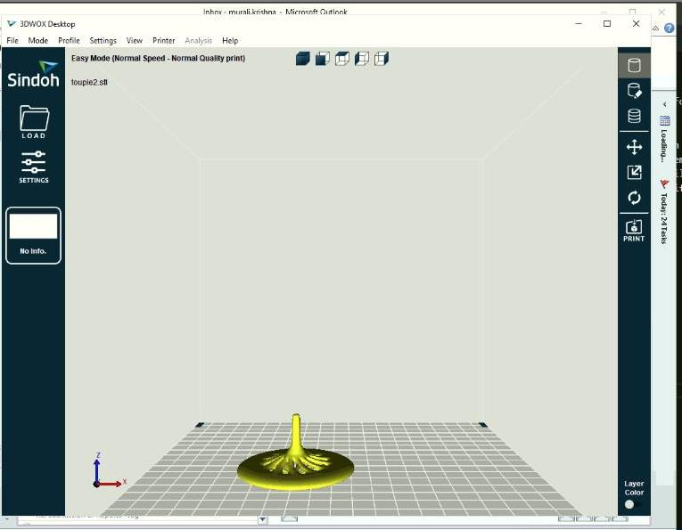

1. Install 3D WOX software.  

2. Open the Website https://www.thingiverse.com/  

3. Download any object which you want to create 3D Object.  

4. Load the Object which you have downloaded into 3D WOX Application. 

 

5. Adject the Scale and Calculate the time. 

6. then Print the Object.