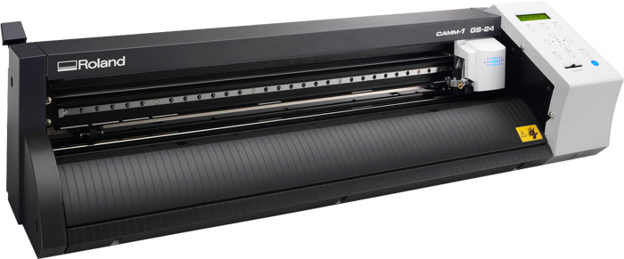
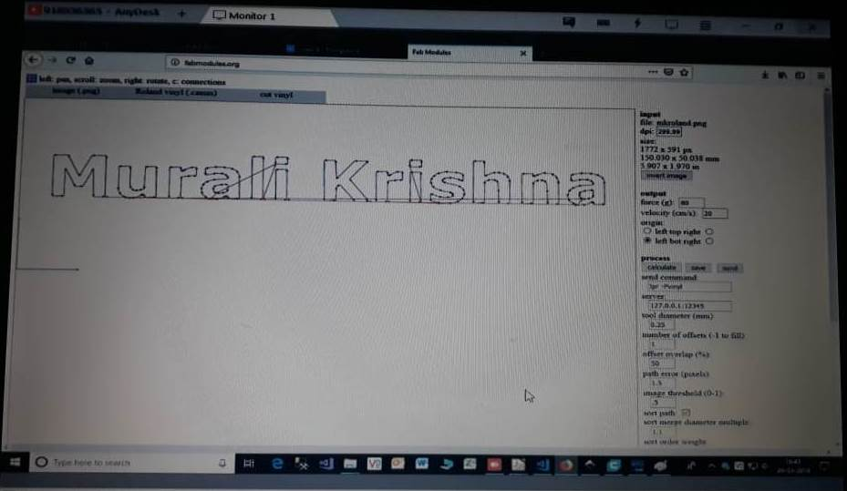

# Roland CAMM1 GS-24 desktop cutter

## Overview
The Roland GX-24 CAMM-1 is a drag knife cutter. You can feed the machine vinyl sticker material for creating custom sized stickers. You can also feed it copper sticker material, useful for flexible circuits or antenna design. The machine can take a material on roll or a piece with the maximum width of 58 centimeters. You will need to prepare a vector graphics file in the shape you want to cut. 

## Links

Video Demo: [Youtube Video](https://www.youtube.com/watch?v=MMMydDwluRM)

[Roland GS-24: Cutting Vinyl Start to Finish](https://www.youtube.com/watch?v=cgqfQxDR6pU)

[How to use the Roland GX-24](http://wiki.fablab.is/wiki/How_to_use_the_Roland_GX-24)

## Workshop

1. Put the role on the two iron rods  

2. Get the role from other end properly, adjust the role  

3. Fix the Small rollers where the white marker are given.  

 

4. open inkscape application. and enter the text. Take the Content to be printed and save as png file.  

5. open the website http://fabmodules.org/ to convert into .camm file  

6. input the .png file. Select the Roland vinyl(.camm) and cut vinyl  

7. in the output set Force: 80 and Velocity : 20. Calculate and save .camm file 

  

8. Goto the Roland Vinyl cutter and set the origin as per the printing material.  

9. set print.  

10. output

